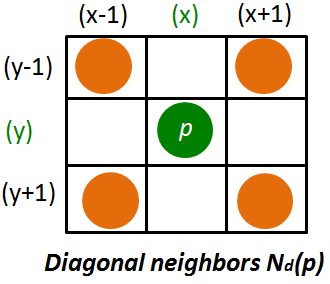

**Connectivity of pixels:**

Pixel connectivity describes a relation between two or more pixels. For two pixels to be connected they have to fulfill certain conditions on the pixel value and spatial adjacency.

The pixel brightness condition: Their pixel values must be from the same set of values C. For a grayscale image, C might be any range of possible gray-level values 0 to 255, e.g. C= {12,13,...40}, for a binary image we simply have C={1}.

In order to understand the spatial adjacency condition, we first explain the notion of neighborhood. For a pixel p with the coordinates (x, y), the set of neighborhood pixels Nd (p) can be defined as follows:

**4- neighbors**

For a pixel p (x,y) shown in green circle, N4(p) is the set of 4-neigbors which share a face (or edge of the pixel) with p. They are four in number and are shown by orange circles. Two pixels p and q are 4-connected if q is in N4(p) and both p, q є C

	

**8 –neighbors:**

For a pixel p (x, y) shown in green circle, N8(p) is the set of neighbours which share a face or a vertex/corner. There are 8 such neighbours and they are shown by orange circles. Two pixels p and q are 8-connected if q is in N8(p) and both p,q є C

	

**m –neighbors (mixed neighbors):**

For a pixel p (x,y) shown in green circle, Nd(p) is the set of diagonal neigbors shown by red circles. Two pixels p and q with values from C are m-connected if:

  i. q is in N4(p), or

  ii. q is in Nd(p), and the set N4(p) N4(q) has no pixels whose values are from C.
	

**Properties of connectivity:**

If we consider a pixel to be connected to itself (trivial connectivity) then connectivity is reflexive. A pixel and its neighbor are mutually connected and hence connectivity is also symmetric. 4-connectivity and 8-connectivity are also transitive: if pixel A is connected to pixel B, and pixel B is connected to pixel C, then there exists a connected path between pixels A and C.

Pixel connectivity is an equivalence relation as it is reflexive, symmetric, and transitive.

**Simplification of the definition of region and boundary in an image:**

Let S represent a subset of pixels in an image. Two pixels are said to be connected in S if there exists a path between them consisting entirely of pixels in S. For a pixel p  S, the set of pixels pi  S that are connected to it is called connected component.

In the event there is only one connected component, the set S is said to be a connected set and S is called a region in the given image.

The boundary of a region R is the set of pixels in the region that have at least one neighbor that is not in R.

**Distance Metrics:**

On a discrete grid, the distance between two points a: (xa, ya) and b: (xb,yb) can be defined in a variety of ways.

Euclidean distance: In vector form, this is referred to as L2 norm.

City-block distance: This is the 4-connected distance and sometime called Manhattan distance.

In vector form, it is referred to as L1 norm.

Chess-board distance: This is the 8-connected distance D8, also called as chess-board distance.

In vector form, it is referred as L norm.

Using these distance metrics, for a given pixel p, one can find pixels at equal distance from this pixel. These pixels form the iso-distance pixel set for the point p.

**Properties of a true distance metric**

Let a, b and c be three pixels with coordinates (xa, ya), (xa, yb) and (xc, yc) respectively. A distance function D is a metric if it has the following properties:

    D(a,b) ≥ 0 and D(a,b) = 0 iff a = b

    D(a, b) = D(a, b)

    D(a, c) ≤ D(a, b) + D(b, c)
